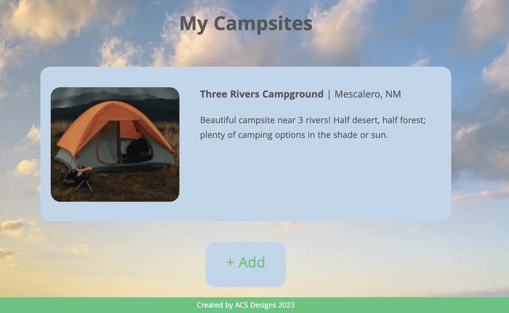
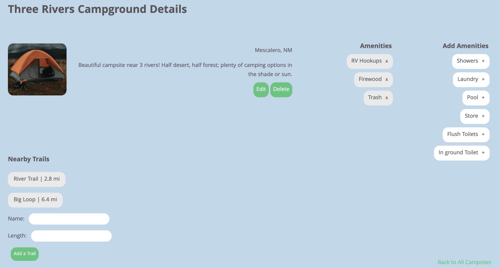

<!-- PROJECT LOGO -->
 

<h2 align="center">
    <a href="https://nature-notes.onrender.com/" target="_blank" rel="noopener noreferrer" >NatureNotes</a>
</h2>

  

    NatureNotes is a collaborative project developed by a team of three outdoor enthusiasts. Our website is designed to make your camping experience more enjoyable and organized. Whether you're an avid camper or just starting out, NatureNotes offers a user-friendly platform to create and manage your personalized list of campsites completed with amenities and nearby hiking trails.
  

<!-- TABLE OF CONTENTS -->

  
Table of Contents

  <ol>
    <li>
      <a href="#project-features">Project Features</a>
      <ul>
        <li><a href="#app-images">App Images</a></li>
        <li><a href="#built-with">Built With</a></li>
      </ul>
    </li>
    <li><a href="#getting-started">Getting Started</a></li>
    <li><a href="#next-steps">Next Steps</li>
  </ol>

## Project Features

(<a href="#readme-top">back to top</a>)

## App Images

(<a href="#readme-top">back to top</a>)

## Built With

* HTML
* CSS
* Python
* Django
* PostgreSQL

(<a href="#readme-top">back to top</a>)

## Getting Started

<h4>How to Use NatureNotes:</h4>
<h5>Click <a href="https://nature-notes.onrender.com/" target="_blank" rel="noopener noreferrer" >here</a> to visit the site!</h5>
<ol>
    <li>Create your own account to access personalized campsite management. Log in securely to your account and keep track of your favorite camping destinations.</li>
    <li>Add new campsites to your account. Include details such as location and a brief description to help you remember the unique features of each site.</li>
    <li>Customize your campsite profile by selecting from a variety of amenities available at each location. Add new amenities as needed, ensuring that your camping experience aligns with your preferences.</li>
    <li>Discover nature by exploring nearby trails associated with each campsite. Add your favorite hikes and memorable moments to your profile.</li> 
</ol>

(<a href="#readme-top">back to top</a>)

## Next Steps

<h4>In future versions, we hope to roll out the following features:</h4>
<ul>
    <li>Users can input a location into the location field on the campsite page, and it will auto-populate a city and state location.</li>
    <li>Users can add multiple photos to each campsite, as well as delete old photos.</li>
    <li>Users can edit or delete trails added to a campsite.</li>
    <li>Users can click a map link on each campsite page that will bring up a map, showing the location of the campsite.</li>
</ul>

(<a href="#readme-top">back to top</a>)

